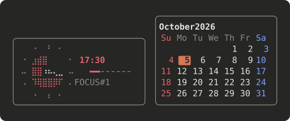

# echo-widget

Widgets above the prompt in Claude Code. Each sits in a rounded box of its
own, and a command switches it on or off. Two so far: a pomodoro timer and a
calendar.



## Install

In Claude Code:

```
/plugin marketplace add echo724/echo-claude-mod
/plugin install echo-widget@echo-claude-mod
```

Then run `/reload-plugins`, or start a new session.

## Uninstall

```
/plugin uninstall echo-widget@echo-claude-mod
```

## Widgets

Both are on after install. The choice is kept across sessions. The boxes sit
side by side on the line above the prompt, each as tall as its content.

| Command | What it does |
| --- | --- |
| `/echo-widget` | List the widgets and whether each is on |
| `/echo-widget pomo` | Switch the pomodoro timer on or off |
| `/echo-widget calendar` | Switch the calendar on or off |

### Pomodoro

| Command | What it does |
| --- | --- |
| `/pomo` | Start, pause or resume the timer |
| `/pomo-skip` | Jump to the next phase |
| `/pomo-reset` | Stop and clear the timer |
| `/pomo-set <focus> [break]` | Set the minutes, e.g. `/pomo-set 50 10` |
| `/pomo-stats` | Time focused and rested, today and in all |

`/pomo skip`, `/pomo reset`, `/pomo stats` and `/pomo 50 10` work too. Type
`/pomo` and the typeahead lists every command.

- Focus is 25 minutes and a break 5 until you set others: focus 1 to 180,
  break 1 to 60. New lengths apply from the next phase that starts.
- The disk is the time left and empties clockwise from twelve. Its colors are
  your theme's: error during focus, success for a break, inactive while paused.
- There is one timer for all your sessions, and it keeps running while Claude
  Code is closed. A phase that runs out with no session open is logged, and the
  timer stops there.
- Every phase is logged by day. A phase you skip or reset counts for the time
  it did run; paused time never counts.
- The box shows only while a timer is set: `/pomo` brings it up and
  `/pomo-reset` takes it away. Starting the timer also switches the widget on,
  and switching the widget off hides the timer without stopping it.

### Calendar

The current month, a week a row, with today marked in your theme's Claude
color, Sundays in its error color and Saturdays in its suggestion color. It
turns over by itself at midnight.

## Add a widget

A widget is a function that returns its box's lines, each a list of spans
with a theme color (`hooks/widget.ts`). `hooks/calendar.ts` is the smallest
one. Add its name to `WidgetId` in `types/index.d.ts` and to `WIDGETS` in
`hooks/register.tsx`, and draw it in the `AbovePrompt` hook.

## Requirements

Written against Claude Code 2.1.289. Mods are an early-access API that moves
between releases, so a later build may need an update here.

## Develop

```
claude plugin validate mods/echo-widget
claude plugin test mods/echo-widget
claude --plugin-dir mods/echo-widget
```
